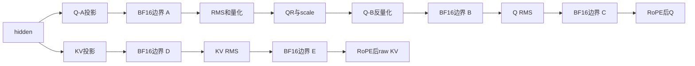

# DSV4 CSA 单因素精度对拍（2026-09-24）

## 结论与边界

26组目标NPU测试全部完成，所有比较使用确定性原生参考、相同权重和可核验的输入。

1. Q-A的BF16舍入有明确独立作用：QR差异从8K的1397个元素降为1个，128K从1355个降为0。
2. Q-B输出和Q RMS到RoPE输出都需要匹配原生BF16边界。以相同QR/scale为输入，
   两个边界均对齐后Q误差降至0.000986% / 0.004372%。
3. KV投影和KV RMS到RoPE两个边界均有作用；raw KV误差降至0.007072% / 0.009388%。
4. O-proj必须分别对齐O-A BF16与8192维整行量化。固定heads后，BF16+8192的OA、INT8和scale均逐元素一致；
   最终输出只剩极小差异，128K的INT32归约控制与原生输出逐元素一致。
5. 上述实验没有一次性合并所有因子。不能用某个独立因子的整层误差不降，否定该模块的同输入改善。
   本轮未部署新的数值算法，未证明整模型精度；仍保留全部非零残差。

## 版本、模型与测试口径

|项目|设置|
|---|---|
|正式基线|`6c4236be9ca9bc6b86c86ea76aaf265474b237bb`，含scatter/QLI修复；CSA算法为39993方向|
|模型|DeepSeek-V4-Flash-0731-w8a8，第2层C4真实权重|
|输入|seed62合成hidden/history；每种长度内逐项核验相同，未用真实请求生成|
|布局|TP1、B4、S6、block128、原生compact容量10行（8有效+2sentinel）|
|上下文|起始8186/131066，结束8192/131072|
|运行|手工Graph capture/replay取数；metadata在捕获外固定|
|确定性|`HCCL_DETERMINISTIC=true`，`set_deterministic_level(1)`并回读|
|CANN / Torch / Torch-NPU|9.2.0-beta.2 / 2.10.0+cpu / 2.10.0.post4|
|vLLM|0.29.0|
|PyPTO|`54957491ede07ad5d5015f5e69874f367113cf45`|
|Simpler|`32dff953d07f6bd2aacab8532860f28aca6df931`，复用既有兼容环境及编译产物|
|PTOAS|0.63|
|测试范围|注意力模块边界精度；不测MoE、DP16/EPLB、接收率、动态padding或生产metadata刷新|

只JIT实验kernel，未重新编译安装vLLM、PyPTO、Simpler。
带诊断Out参数、克隆和额外量化扫描，**本轮不提供性能结论**；不能将实验耗时替代正式Graph延迟。

## 归因设计

五个QKV独立因子均从同一control生成，其他源文件逐字节相同；CPU测试校验生成器没有偷偷累积因子。
另有两条增量边：q_mm→q_pair只加Q RMS舍入，kv_mm→kv_pair只加KV RMS舍入。

raw KV在本文指未经压缩、经过RMS和RoPE、写入滑窗cache的KV。
所有权重在运行前、原生运行后、CSA运行后比较CPU快照。Graph warmup/capture后恢复初始cache再replay。
跨组还核验hidden、初始cache、权重和native QR/Q/raw KV/heads/output的SHA256一致。
Q-only的六类cache逐元素不变；KV-only的QR/Q及另外五类cache逐元素不变。所有断言通过。

## 每步完整输出对比

以下数值均为相对原生的 **relative L2百分比**。control的O-proj已经固定为正式8192量化实现。
pair不能直接相对control归因；只能对照上文指定父组。`Q同QR`是把当前CSA的QR/scale送进原生Q-B→Q RMS→RoPE，
用于隔离Q-A/QR的上游差异。allclose、max abs、不同元素数和QR scale指标见完整JSON。

### 8K

|变体|QR|Q|Q同QR|raw KV|heads|最终输出|
|---|---:|---:|---:|---:|---:|---:|
|control|0.657385|0.672720|0.286541|0.286057|0.901364|1.435012|
|qa|0.017588|0.287317|0.286905|0.286057|0.771565|1.320203|
|q_mm|0.657385|0.682443|0.103247|0.286057|0.902553|1.432434|
|q_rms|0.657385|0.673201|0.283232|0.286057|0.901815|1.431955|
|q_pair|0.657385|0.681181|0.000986|0.286057|0.901680|1.434227|
|kv_mm|0.657385|0.672720|0.286541|0.082274|0.855451|1.374110|
|kv_rms|0.657385|0.672720|0.286541|0.283917|0.902479|1.437168|
|kv_pair|0.657385|0.672720|0.286541|0.007072|0.851359|1.345587|

### 128K

|变体|QR|Q|Q同QR|raw KV|heads|最终输出|
|---|---:|---:|---:|---:|---:|---:|
|control|0.641952|0.662512|0.287743|0.289912|1.284894|1.691886|
|qa|0.000000|0.287116|0.287112|0.289912|1.036972|1.518724|
|q_mm|0.641952|0.671588|0.103332|0.289912|1.285613|1.698166|
|q_rms|0.641952|0.663499|0.285137|0.289912|1.285916|1.695901|
|q_pair|0.641952|0.670879|0.004372|0.289912|1.285071|1.693518|
|kv_mm|0.641952|0.662512|0.287743|0.081749|1.249621|1.655926|
|kv_rms|0.641952|0.662512|0.287743|0.288162|1.284465|1.687517|
|kv_pair|0.641952|0.662512|0.287743|0.009388|1.247225|1.642482|

Q-B-only的完整Q误差略增，但同QR误差从约0.287%降到0.103%；加Q RMS边界后进一步下降约两个数量级。
这说明上游QR错误会影响端到端误差，不能把“完整Q未变好”解释成Q-B边界不需要对齐。
KV RMS-only改善很小，而在KV投影已对齐后再增加RMS边界，raw KV误差从约0.082%降到0.007%～0.009%。

## Cache：逐组记录而不以未变化history稀释误差

只比较原生metadata提供的有效写槽，保存slot坐标与双方实际值；初始backing单独保存hash。
这里不声称覆盖所有未写槽的完整storage一致性。

### 8K cache误差（%）

|变体|compressed|raw|main state|inner state|index key|index scale|
|---|---:|---:|---:|---:|---:|---:|
|control|0.000112906|0.2860565|3.043687e-05|3.120208e-05|0.6326092|0.2613235|
|qa|0.000112906|0.2860565|3.043687e-05|3.120208e-05|0.6326092|0.2613235|
|q_mm|0.000112906|0.2860565|3.043687e-05|3.120208e-05|0.6326092|0.2613235|
|q_rms|0.000112906|0.2860565|3.043687e-05|3.120208e-05|0.6326092|0.2613235|
|q_pair|0.000112906|0.2860565|3.043687e-05|3.120208e-05|0.6326092|0.2613235|
|kv_mm|0.000112906|0.08227441|3.043687e-05|3.120208e-05|0.6326092|0.2613235|
|kv_rms|0.000112906|0.2839172|3.043687e-05|3.120208e-05|0.6326092|0.2613235|
|kv_pair|0.000112906|0.007071848|3.043687e-05|3.120208e-05|0.6326092|0.2613235|

### 128K cache误差（%）

|变体|compressed|raw|main state|inner state|index key|index scale|
|---|---:|---:|---:|---:|---:|---:|
|control|0|0.2899118|2.952633e-05|3.187674e-05|0.6351376|0.2856495|
|qa|0|0.2899118|2.952633e-05|3.187674e-05|0.6351376|0.2856495|
|q_mm|0|0.2899118|2.952633e-05|3.187674e-05|0.6351376|0.2856495|
|q_rms|0|0.2899118|2.952633e-05|3.187674e-05|0.6351376|0.2856495|
|q_pair|0|0.2899118|2.952633e-05|3.187674e-05|0.6351376|0.2856495|
|kv_mm|0|0.08174934|2.952633e-05|3.187674e-05|0.6351376|0.2856495|
|kv_rms|0|0.2881623|2.952633e-05|3.187674e-05|0.6351376|0.2856495|
|kv_pair|0|0.009388022|2.952633e-05|3.187674e-05|0.6351376|0.2856495|

index key/scale仍保持控制组差异；本轮没有改动Indexer/Hadamard，因此不能把其他模块的修复说成整层已一致。

## O-proj：固定heads的2×2与归约控制

所有组使用相同control的native heads和相同O-A/O-B权重；QR/Q/raw KV/cache只引用冻结上游工件。
这些上游指标的零差异表示未重算，不代表CSA上游精度通过。

|编号|变体|O-A量化前边界|量化范围|归约|
|---|---|---|---|---|
|A|oa32_group|FP32|1024/group|FP32逐组反量化求和|
|B|oa16_group|BF16|1024/group|同A|
|C|oa32_global|FP32|8192/row|同A|
|D|oa16_global|BF16|8192/row|同A|
|E|oa16_global_intsum|BF16|8192/row|INT32求和再一次反量化|

A→B和C→D只改O-A舍入；A→C和B→D只改量化范围；D→E只改归约。
所有组的weight scale统一在求和后相乘，避免混入分配律造成的另一处舍入。

|变体|8K输出误差%|128K输出误差%|8K不同元素数|128K不同元素数|
|---|---:|---:|---:|---:|
|oa32_group|1.60827355|1.55163039|87453|87038|
|oa16_group|1.54409149|1.48846087|86929|86471|
|oa32_global|0.59056435|0.58593545|69886|69201|
|oa16_global|0.00004142|0.00066950|1|2|
|oa16_global_intsum|0.00004270|0.00000000|3|0|

B→D把约1.5%的误差降到极小量级，独立确认整行8192量化的重要性；C→D则确认O-A BF16边界也不可省略。
D/E在两种长度的OA、INT8和scale均与原生逐元素一致。8K最终分别只有1/3个元素不同，max abs均为3.0517578125e-5；
128K的E最终输出逐元素一致。小残差不应扩大表述成所有输入、所有模型均bit-exact。

不同量化域的INT8编码不能直接解释为反量化误差；JSON另给出INT8×各自scale后的activation差异。
为统一实验调度，global格会重复扫描8组，因此本实验不能比较正式O-proj性能。

## 工件与复现

- 测试脚本与步骤：[测试README](../../../benchmarks/scripts/dsv4_csa_precision/README.md)。
- 完整指标、父子边对照及工件指纹：[结果JSON](DSV4_CSA_SINGLE_FACTOR_20260924.json)。
- 每个case保存`result.json`和`stages.pt`；QKV工件包含全部要求的中间张量与六类cache写槽。
- O-proj工件额外保存OA FP32、INT8、scale与最终输出，并引用同一冻结上游工件及其hash。
- 首两组随后只给runner增加了source hash记录；计算函数未改，全部生成kernel文件指纹由manifest核验。
- 已通过生成器CPU回归、独立静态审查、26组NPU执行，以及全部跨组输入/原生输出/无关分支一致性断言。
- Ruff、format、codespell和typos通过；Gitleaks因本机缺少gitleaks及wget未运行。

后续应继续对剩余Q/KV的少量差异与Indexer/attention做同输入定位；本轮没有将多个数值实验合入正式算法。
